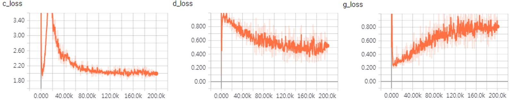
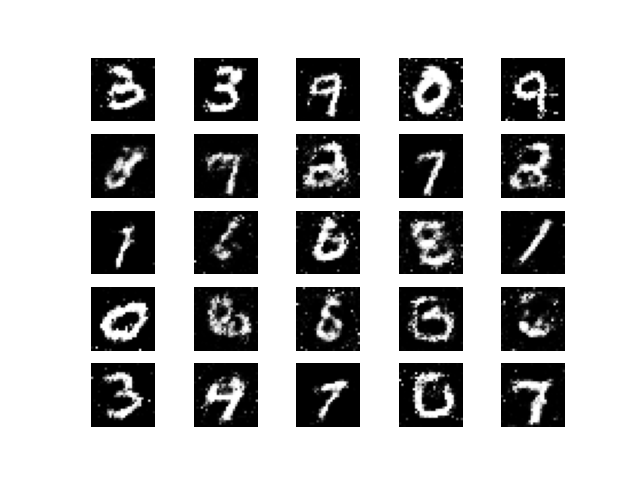

# Triple GANs

Deep Generative models(DGM) are neural networks which tries to estimate the
likelihood of each observation and to create new samples from the underlying
distribution of data, Synthetic data generation is a specific application of deep
generative models where the goal is to create realistic and novel data samples.
GANs, in particular, consist of a generator network that produces new samples
and a discriminator network that distinguishes between real and generated samples.
Through an adversarial training process, both networks improve iteratively, with
the generator learning to produce more realistic data.


However, challenges exist. Ensuring diversity and realism in generated samples
is an ongoing research focus. Issues like training stability, mode collapse, and
addressing biases in generated data are important considerations. Ethical concerns
regarding the potential misuse of synthetic data and privacy implications must be
taken into account. The Triple GAN focuses on classification and class-conditional
generation of data samples and also a better framework to work with as it requires
less number of epochs to train, can perform well even without data argumentation
and can perform semi-supervised learning(SSL) tasks better.

### **Triple GAN Architecture**  
 

This repository contains an implementation of **Triple GAN**, a generative adversarial network designed to simultaneously improve image generation and classification through a joint training approach.  

## Overview  

Triple GAN consists of three networks:  
1. **Generator (G)** - Generates realistic images from latent vectors.  
2. **Discriminator (D)** - Distinguishes between real and generated images while also serving as a classifier.  
3. **Classifier (C)** - Assigns labels to images and enhances classification performance using adversarial learning.  

By balancing the adversarial loss and classification loss, Triple GAN achieves **better sample generation** and **more robust classification** than conventional GANs.  

## Mathematical Formulation  

The optimization objective of Triple GAN is formulated as:  

$$
\min_{C,G} \max_D E_{p(x,y)} [\log D(x, y)] + \alpha E_{p_c(x,y)} [\log(1 - D(x, y))] + (1 - \alpha) E_{p_g(x,y)} [\log(1 - D(G(y, z), y))]
$$

where:
where:  
- $p(x, y)$ represents the true data distribution,  
- $p_c(x, y)$ is the classifier-based sample distribution,  
- $p_g(x, y)$ is the generator-based sample distribution,  
- $\alpha$ is a balancing parameter.


## Dependencies  

Ensure you have the following installed:  
- Python 3.x  
- TensorFlow  
- NumPy  
- Matplotlib  
- Pandas  
- Jupyter Notebook  

Install dependencies using:  
```bash
pip install tensorflow numpy matplotlib pandas jupyter
```

## Usage  

1. **Clone the repository:**  
   ```bash
   https://github.com/Rupesh4604/Triple-GAN.git
   cd Triple-GAN-notebook
   ```  
2. **Open the Jupyter Notebook:**  
   ```bash
   jupyter notebook notebook-triplegan-2.ipynb
   ```  
3. **Run the notebook** to train the Triple GAN model and visualize the results.  

## Architecture


## Loss  
  

<!-- 
### **2. Loss**  
  

### **3. Generated Outputs on MNIST**  
  
-->

## License  
This project is licensed under the **MIT License**.  

### Contact  
For queries or contributions, contact: **rupesh32003@gmail.com**  
